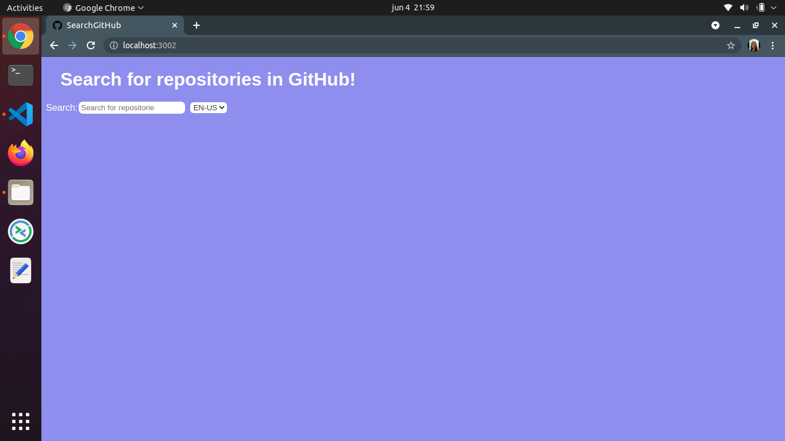

<strong>SearchGitHub<strong>

 É um projeto construído com HTML, CSS e Javascript, com o objetivo de pesquisar por repositórios do GitHub através de uma palavra-chave.

A tela inicial do projeto contém um campo para a pesquisa e outro para selecionar a linguagem, contendo as opções, pt-br, en-US, en-AU e JA.  

